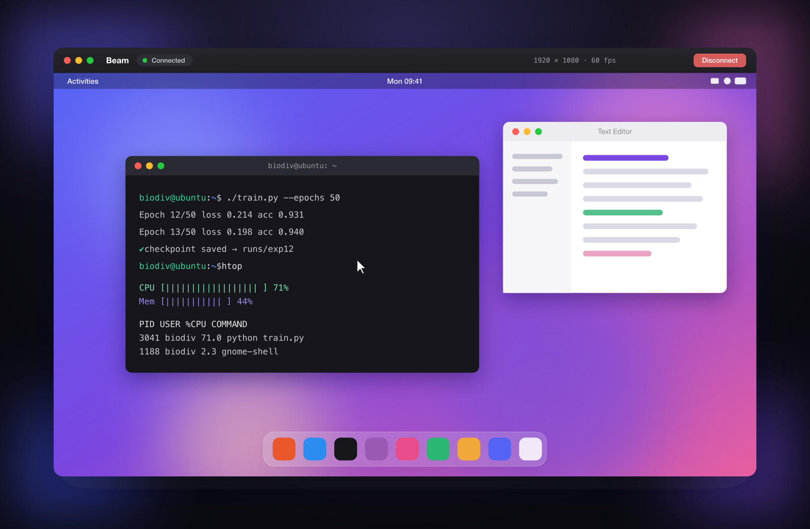

# Beam

A clean, native macOS remote‑desktop client for Ubuntu. It speaks the **VNC
(RFB) protocol** directly — implemented from scratch in Swift over
`Network.framework` — so you see the real Ubuntu desktop and control it with
your mouse and keyboard, optionally tunnelled securely over SSH.

<p align="center">
  
</p>

<p align="center">
  <a href="https://github.com/Alyetama/beam/releases/latest/download/Beam.dmg"><b>⬇&nbsp; Download&nbsp;Beam.dmg</b></a>
  &nbsp;·&nbsp; macOS&nbsp;14+ · Apple&nbsp;Silicon &nbsp;·&nbsp;
  <a href="https://alyetama.github.io/beam/">Website</a>
</p>

## Installing (first launch)

Beam is open source but isn’t signed with a paid Apple Developer ID, so macOS
Gatekeeper blocks it the first time. This is a **one-time** step:

1. Open `Beam.dmg` and drag **Beam** into your **Applications** folder.
2. In Applications, **right-click** (or Control-click) **Beam** → choose **Open**.
3. Click **Open** again in the dialog. macOS remembers your choice from then on.

If macOS 15 (Sequoia) still blocks it:

- Open Beam once, then go to **System Settings → Privacy & Security**, scroll
  down, and click **Open Anyway** next to “Beam was blocked”; **or**
- Remove the quarantine flag in Terminal, then open Beam normally:

  ```bash
  xattr -dr com.apple.quarantine /Applications/Beam.app
  ```

## Why VNC (and not screen‑scraping over SSH)

The proper way to mirror and control a Linux desktop is the Remote Framebuffer
protocol: the server only sends the regions of the screen that change, so it's
fast and responsive. Because raw VNC is unencrypted, Remote can transparently
forward the connection through an **SSH tunnel**, giving you VNC's efficiency
with SSH's security.

## Features

- **Native rendering** — framebuffer is blitted straight to a `CALayer`; no web
  views, no embedded clients.
- **Encodings:** Raw, CopyRect, and Hextile (supported by every common server —
  x11vnc, TigerVNC, GNOME), plus the DesktopSize pseudo‑encoding for live
  resolution changes.
- **Full input:** mouse move / drag, left‑middle‑right buttons, scroll wheel,
  and a full keyboard with macOS → X11 keysym mapping. Optionally map **⌘ → Ctrl**
  so Linux shortcuts feel natural.
- **Secure by default option:** one toggle tunnels everything over SSH
  (keys, ssh‑agent, identity files, or password via an askpass helper).
- **VNC authentication** (DES challenge/response) built in.
- **Saved connections**, a live status/FPS readout, full‑screen mode, and a
  view‑only mode.

## Build & run

Requires macOS 14+ and a Swift toolchain (Xcode 15+).

```bash
./scripts/bundle.sh        # builds build/Beam.app
open build/Beam.app
```

Or run straight from SwiftPM during development:

```bash
swift run
```

## Setting up the Ubuntu side

On the Ubuntu machine, run the helper (it installs `x11vnc`, attaches it to your
real `:0` display, and sets a VNC password):

```bash
./remote-setup.sh            # prints the command to start the server
./remote-setup.sh --service  # or install it as a systemd user service
```

> **Wayland note:** `x11vnc` needs an Xorg session. If you're on Wayland, log out
> and choose **“Ubuntu on Xorg”** at the login screen, or use GNOME's built‑in
> Remote Desktop sharing.

Then in the Mac app, create a connection:

| Field            | Value                                   |
|------------------|-----------------------------------------|
| Tunnel over SSH  | **On** (recommended)                    |
| SSH Host / User  | the machine's address + your login      |
| VNC Host         | `localhost`                             |
| Display          | `0`  (→ port 5900)                       |
| VNC Password     | the password set by `remote-setup.sh`   |

For a trusted LAN you can turn the SSH tunnel off and point **VNC Host** straight
at the machine's IP.

## How it works

```
┌────────────── macOS app ──────────────┐        ┌──────── Ubuntu ────────┐
│ SwiftUI UI                             │        │                        │
│   └ RFBClient (Network.framework)      │  RFB   │  x11vnc ⇄ X11 :0       │
│       ├ handshake + VNC auth (DES)     │◀──────▶│  (the real desktop)    │
│       ├ Raw / CopyRect / Hextile decode│ over   │                        │
│       ├ Framebuffer → CGImage          │ SSH ▲  │                        │
│       └ Pointer / Key events           │     │  └────────────────────────┘
│   └ SSHTunnel (ssh -L, optional) ──────┼─────┘
└────────────────────────────────────────┘
```

Source layout (`Sources/Remote/`):

- `VNC/` — the protocol core: `ByteChannel` (async socket reader), `RFBClient`
  (state machine + decoders + input), `Framebuffer`, `VNCAuth`, `Keysyms`,
  `SSHTunnel`.
- `Models/` — `Connection` profiles + JSON persistence.
- `Views/` — SwiftUI shell (sidebar, editor, live session, AppKit input surface).

## Limitations / roadmap

- No Tight/ZRLE yet — Hextile keeps bandwidth reasonable on a LAN but those
  encodings would help over slower links.
- No clipboard sync or file transfer.
- No TLS‑based VNC (use the SSH tunnel instead).
