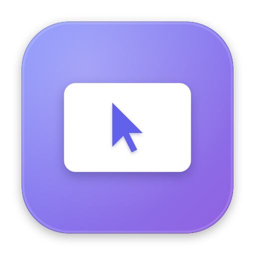

<div align="center">



# Beam

**A clean, native macOS remote desktop for your Ubuntu machine.**


[**⬇ Download**](https://github.com/Alyetama/Beam/releases/latest/download/Beam.dmg) &nbsp;·&nbsp;
[Website](https://alyetama.github.io/Beam/) &nbsp;·&nbsp; macOS&nbsp;14+ &nbsp;·&nbsp; Apple&nbsp;Silicon

</div>

---

Beam talks **VNC (RFB)** directly — a client written from scratch in Swift on
`Network.framework`. You get the real Ubuntu desktop with mouse and keyboard, and its
own cursor drawn locally so the pointer keeps up. VNC is unencrypted, so there's a
one-toggle **SSH tunnel** for when you're not on a trusted network.

<details>
<summary><b>Install (first launch)</b></summary>

<br>

Beam isn't signed with a paid Apple Developer ID (I don't have one), so macOS blocks it the first time. One-time step:

1. Open `Beam.dmg` and drag **Beam** into **Applications**.
2. Right-click (Control-click) **Beam** → **Open** → **Open**.

On macOS 15 (Sequoia), if it's still blocked: **System Settings → Privacy & Security → Open Anyway**, or run:

```bash
/usr/bin/xattr -dr com.apple.quarantine /Applications/Beam.app
```

</details>

<details>
<summary><b>Set up the Ubuntu side</b></summary>

<br>

Beam needs a VNC server on your desktop. Run the helper on the Ubuntu machine:

```bash
./remote-setup.sh            # installs x11vnc, detects display, sets a password
./remote-setup.sh --service  # or run it as a background service
```

Then in Beam, add a connection: the machine's IP or Tailscale name, display `0`, and your VNC password.

> **Wayland:** x11vnc needs Xorg — pick "Ubuntu on Xorg" at the login screen.

</details>

<details>
<summary><b>Build from source</b></summary>

<br>

Requires macOS 14+ and a Swift toolchain (Xcode 15+).

```bash
./scripts/bundle.sh     # builds build/Beam.app
open build/Beam.app
```

Or `swift run` during development. `./scripts/make_dmg.sh` packages a `.dmg`.

</details>

<details>
<summary><b>How it works</b></summary>

<br>

```
macOS app (SwiftUI)                         Ubuntu
  RFBClient — Network.framework  ──RFB──▶   x11vnc ⇄ X11 :0
    handshake · VNC auth · decode  (over     (the real desktop)
    framebuffer · pointer/keys     SSH ▲)
  SSHTunnel (ssh -L, optional) ────────┘
```

Source (`Sources/Remote/`): `VNC/` (protocol core — `RFBClient`, `Framebuffer`,
`VNCAuth`, `ByteChannel`, `SSHTunnel`), `Models/`, `Views/`.

</details>

<details>
<summary><b>Security & limitations</b></summary>

<br>

- Saved credentials live in `~/Library/Application Support/Remote/connections.json`, `chmod 600` (Keychain is on the roadmap).
- SSH host keys use trust-on-first-use; VNC has no TLS — use the SSH tunnel (or Tailscale).
- Ad-hoc signed, not notarized (hence the install step above).
- No Tight/ZRLE encoding or clipboard sync yet.

</details>

---

<div align="center"><sub>Made with Swift · not affiliated with Canonical or Ubuntu</sub></div>
